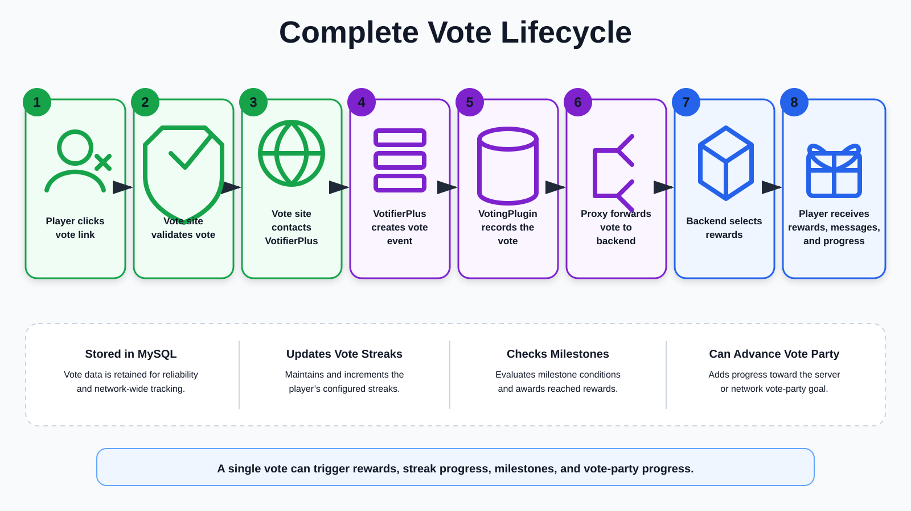

# VotingPlugin — Overview

VotingPlugin is a highly configurable Minecraft voting and rewards system for **Spigot/Paper**, with optional **BungeeCord/Velocity** proxy support.

## Highlights

- Reliable handling for online and offline votes
- Flexible site, milestone, top-voter, streak, and vote-party rewards
- Standalone-server and proxy-network support
- PlaceholderAPI integration
- In-game administration and configuration tools
- SQLite and MySQL storage

## Supported Platforms

- **Spigot/Paper:** 1.19+
- **Proxies:** BungeeCord, Waterfall, and Velocity
- **Vote listeners:** VotifierPlus, NuVotifier, and compatible alternatives

## Default File Layout

The default resources are available in the [VotingPlugin repository](https://github.com/BenCodez/VotingPlugin/tree/master/VotingPlugin/src/main/resources).

### Backend server files

Path: `/plugins/VotingPlugin/`

| File / folder | Description |
|---|---|
| `Rewards/` | Reward files and generated directly defined rewards |
| `TopVoter/` | Previous top-voter data when enabled |
| `BungeeSettings.yml` | Backend proxy-network settings |
| `Config.yml` | Main plugin configuration |
| `GUI.yml` | GUI configuration |
| `Shop.yml` | VoteShop configuration |
| `ServerData.yml` | Internal vote-party and top-voter data; do not edit |
| `SpecialRewards.yml` | AllSites, VoteParty, milestone, cumulative, and other special rewards |
| `Users.db` | SQLite player data |
| `VoteSites.yml` | Vote-site definitions, delays, URLs, and rewards |

### Proxy files

| File | Description |
|---|---|
| `bungeeconfig.yml` | Proxy-side VotingPlugin configuration |
| `nonvotedplayerscache.json` | Cache used with `AllowUnJoined: false` |
| `secretkey.key` | Encryption key used by SOCKETS and optional plugin-message encryption |
| `votecache.json` | Vote cache used by PLUGINMESSAGING |

## Quick Start

1. Install **VotifierPlus** or another compatible vote listener.
2. Place VotingPlugin in the server's `/plugins/` directory.
3. Configure `/plugins/VotingPlugin/VoteSites.yml`.
4. Configure rewards and other preferences.
5. Restart and send a test vote.

> Proxy networks must also configure `bungeeconfig.yml`, `BungeeSettings.yml`, and a shared MySQL database.
{.is-info}

## How a Vote Is Processed

The exact path depends on whether the server is standalone or part of a proxy network, but this diagram shows a typical proxy-network lifecycle:

> Standalone servers skip proxy forwarding and process the vote locally. Configuration can change where totals, vote parties, and rewards are processed.
{.is-info}

## Commands and Permissions

| Command | Description |
|---|---|
| `/vote` | Shows vote sites and player totals |
| `/v` | Alias for `/vote` |
| `/adminvote` | Administration command root |
| `/av` | Alias for `/adminvote` |

`VotingPlugin.Player` is the main permission for player commands and is granted by default unless changed in `Config.yml`.

See [Commands and Permissions](VotingPlugin/Commands-&-Permissions) for the full list.

## Storage

VotingPlugin supports:

- **SQLite** — default local storage in `Users.db`
- **MySQL** — recommended for proxy networks and multi-server installations

## Reward System

Rewards can include commands, messages, experience, points, items, titles, action bars, random ranges, and more. Offline rewards are normally delivered when the player next joins.

See [Rewards](VotingPlugin/Rewards) and [Reward Examples](VotingPlugin/Reward-Examples).

## Configuration Highlights

| Option / file | Description |
|---|---|
| `OnlineMode` | Controls online/offline UUID handling; see [Online / Offline Mode](VotingPlugin/Online-Offline-Mode) |
| `VoteReminderOptions` and `VoteReminders` | Current configurable reminder system; see [Vote Reminders](VotingPlugin/VoteReminders) |
| Top-voter settings | Monthly and weekly tracking and resets |
| `BungeeSettings.yml` | Backend proxy-network configuration |
| `SpecialRewards.yml` | AllSites, VoteParty, milestone, cumulative, and other special rewards |

## Network / Proxy Setup

VotingPlugin supports these `BungeeMethod` values, matching the current default configuration:

- **PLUGINMESSAGING** — recommended for most networks
- **REDIS** — Redis pub/sub communication
- **MQTT** — MQTT broker communication
- **MYSQL** — MySQL-backed message queue
- **SOCKETS** — direct socket communication; advanced and not recommended for most networks

See [Proxy Setups](VotingPlugin/Proxy-Setups).

## Troubleshooting

- Confirm the vote listener is installed and receiving votes.
- Verify vote-site ports, tokens, public keys, and service-site names.
- Use `/adminvote` test commands.
- Review server and proxy logs.
- See [Votifier Troubleshooting](VotingPlugin/Votifier-Troubleshooting) and the [FAQ](VotingPlugin/faq).

## Related Pages

- [Setup](VotingPlugin/setup)
- [File Layout](VotingPlugin/File-Layout)
- [Service Sites](VotingPlugin/Service-sites)
- [Rewards](VotingPlugin/Rewards)
- [Vote Reminders](VotingPlugin/VoteReminders)
- [Proxy Setups](VotingPlugin/Proxy-Setups)
- [Online / Offline Mode](VotingPlugin/Online-Offline-Mode)
- [Commands and Permissions](VotingPlugin/Commands-&-Permissions)

## Support

Report issues on the [VotingPlugin GitHub repository](https://github.com/BenCodez/VotingPlugin/issues) or ask in the support Discord.

> Keep VotingPlugin and your vote-listener plugin updated for the best compatibility.
