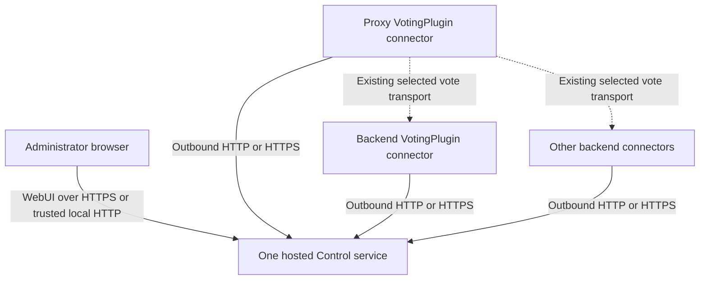

# VotingPlugin Control WebUI

> **Development-build feature:** Control integration is not available in the latest public VotingPlugin release, **7.1.1**. Unless a section is marked as later active development, the management and inspection suite described here requires a `7.1.2-SNAPSHOT` build containing merged commit [`034e39aa`](https://github.com/BenCodez/VotingPlugin/commit/034e39aae5890db249a51109fa0ee2d2561b7142) or later and [VotingPlugin-Control v0.1.7](https://github.com/BenCodez/VotingPlugin-Control/releases/tag/v0.1.7). Release users do not have the VotingPlugin connector or hosting settings yet. Details may change before VotingPlugin 7.1.2 is released.
{.is-warning}

VotingPlugin Control is an optional, local-first management application for a VotingPlugin network. Its WebUI can show enrolled proxies and backends, coordinate reviewed configuration changes, and request bounded read-only diagnostics from capable backend nodes.

Control does **not** receive votes or replace VotingPlugin's existing proxy communication method. Voting continues normally if Control is stopped, slow, unavailable, or disabled.

## Active development after Control v0.1.7

> **Not available in Control v0.1.7:** Automatic selected-server loading, negotiated HTTP proxy-method switching, the private VotingPlugin artifact store, and VotingPlugin JAR staging are proposed by stacked Control PRs [#13](https://github.com/BenCodez/VotingPlugin-Control/pull/13), [#14](https://github.com/BenCodez/VotingPlugin-Control/pull/14), and [#15](https://github.com/BenCodez/VotingPlugin-Control/pull/15). Their node-side capabilities require VotingPlugin PR [#1594](https://github.com/BenCodez/VotingPlugin/pull/1594) at commit [`2e49dd66`](https://github.com/BenCodez/VotingPlugin/commit/2e49dd66699aefe24a572416053c9954e6e864e4) or later. All four PRs remain open and unreleased; do not rely on these workflows until compatible public releases exist.
{.is-warning}

The proposed stack adds these bounded workflows without changing Control's role in vote processing:

- Selecting a server automatically loads its current settings, clears stale editor state, and rereads confirmed state after an apply.
- HTTP method selection uses negotiated `config.proxy-method.v2`; older nodes remain connected but are excluded from HTTP previews and applies.
- An administrator can upload a VotingPlugin JAR into a private, content-addressed store and stage it only on selected nodes advertising `plugin.deploy.v1`.
- Staging verifies the artifact identity and SHA-256, reports per-node results, and ends at `RESTART_REQUIRED`. Control does not reload or restart a Minecraft process automatically.
- A retry creates a new operation for currently eligible failed targets; it does not replay successful targets implicitly.

These workflows still require their open review findings to be resolved. Continue using manual VotingPlugin updates and manual HTTP configuration in the meantime.

## Architecture



Run one Control service for the network. It can be supervised by either one BungeeCord/Velocity proxy or one Bukkit/Paper backend. Every participating proxy or backend initiates its own outbound connection to Control; enabling Control does not open an inbound listener inside a Minecraft process.

Hosting and enrollment are separate:

- `Control.Hosted.Enabled` supervises the separate Control child JVM.
- Proxy `Control.Enabled` enrolls that proxy.
- Backend `Control.Backend.Enabled` enrolls that backend for configuration and inspection features.

## Before you start

1. Back up the VotingPlugin configuration on every participating node.
2. Install the same compatible VotingPlugin development build on the proxy and backends you will manage.
3. Decide which **one** proxy or backend will host Control.
4. Decide how every enrolled node will reach that listener.
5. Use loopback or a trusted private network for HTTP. Use HTTPS or a private authenticated tunnel across an untrusted network.
6. Give every proxy and backend a unique, stable node identity.

Control authentication does not encrypt traffic. Never expose a plaintext Control listener directly to the public internet.

## Host Control on a proxy

This is the simplest layout when all backends can reach the proxy's private address. In the hosting proxy's `bungeeconfig.yml`:

```yaml
Control:
  Enabled: true
  Endpoint: 'http://127.0.0.1:8080'
  NodeId: ''
  CredentialFile: 'control/control-credential.txt'
  HeartbeatSeconds: 30
  ConnectTimeoutMillis: 3000
  RequestTimeoutMillis: 5000
  Hosted:
    Enabled: true
    AutoDownload: true
    AutoUpdate: true
    DownloadUrl: ''
    Sha256: ''
    JarFile: 'control/votingplugin-control.jar'
    DataDirectory: 'control/data'
    Host: '127.0.0.1'
    Port: 8080
    StartupTimeoutSeconds: 30
    DownloadTimeoutSeconds: 60
```

A blank proxy `NodeId` reuses `ProxyServerName`. Every simultaneously connected proxy must still resolve to a different stable ID.

`Host: '127.0.0.1'` makes the WebUI reachable only from the proxy host. Keep this default when using an SSH tunnel or local reverse proxy. Bind to a private interface only when remote backends or administrators must reach Control directly.

## Host Control on a backend

In the hosting backend's `Config.yml`:

```yaml
Control:
  Hosted:
    Enabled: true
    AutoDownload: true
    AutoUpdate: true
    DownloadUrl: ''
    Sha256: ''
    JarFile: 'control/votingplugin-control.jar'
    DataDirectory: 'control/data'
    Host: '127.0.0.1'
    Port: 8080
    StartupTimeoutSeconds: 30
    DownloadTimeoutSeconds: 60
  Backend:
    Enabled: true
    NodeId: ''
    Endpoint: 'http://127.0.0.1:8080'
    CredentialFile: 'control/control-credential.txt'
    HeartbeatSeconds: 30
    ConnectTimeoutMillis: 3000
    RequestTimeoutMillis: 10000
```

A blank backend `NodeId` reuses `BungeeSettings.Server`. The value must be unique and stable.

Only one server should set `Control.Hosted.Enabled: true`. Other nodes should enable only their connector and point `Endpoint` to the selected host.

## Download and update behavior

With a blank `DownloadUrl` and `Sha256`, the hosted manager selects the latest stable `BenCodez/VotingPlugin-Control` GitHub release, verifies the immutable release and exact asset name, then checks the JAR against GitHub's published SHA-256 digest before activation. `AutoUpdate: true` checks for a newer stable release every six hours.

The hosted application runs as a separate child JVM using the host's Java runtime. A candidate is staged and verified before the healthy version is stopped. VotingPlugin retains the previous verified JAR for rollback and quarantines a failed digest until a newer release is available.

To pin an exact build, configure both an immutable versioned `DownloadUrl` and its exact `Sha256`. For an offline installation, place the JAR at `JarFile`, set its exact `Sha256`, and disable both automatic download and update.

## First WebUI login

On the first successful start, Control writes a one-time setup code inside the configured data directory:

```text
control/data/web-setup-code.txt
```

1. Open the Control WebUI.
2. Read the setup code through the server's file manager or local filesystem.
3. Enter it in the browser and choose the administrator password.
4. Store the password in a password manager.

The setup code is consumed immediately. Changing the WebUI password invalidates existing browser sessions.

## Enroll proxies and backends

Each node receives a separate credential bound to its stable node ID. A credential for one node cannot authenticate as another node. Browser sessions and API automation credentials are also separate from node credentials.

### Proxy-hosted automatic enrollment

When the proxy hosts Control and enrolls itself through the same local listener, VotingPlugin can generate the proxy credential and install only its SHA-256 verifier into Control automatically.

For backend automatic enrollment through plugin messaging, each backend uses:

```yaml
Control:
  Backend:
    Enabled: true
    NodeId: ''
    Endpoint: 'http://proxy-private-address:8080'
    CredentialFile: 'control/control-credential.txt'
    HeartbeatSeconds: 30
    ConnectTimeoutMillis: 3000
    RequestTimeoutMillis: 10000
```

The backend keeps the raw credential locally and sends only its verifier through the proxy. `Endpoint` must be reachable **from the backend**. Do not use `localhost` for a Control process running on a different machine.

Automatic backend enrollment requires the normal plugin-message relationship and a node identity matching `BungeeSettings.Server`. External Control installations, custom node IDs, and other proxy transports use manual enrollment in the WebUI or owner tooling.

Do not copy one credential file between servers. Keep every credential file inside its node's VotingPlugin data directory and exclude it from public backups, screenshots, and support bundles.

## Use the workspace

The WebUI is capability-driven. Select a node and check its accepted capabilities instead of assuming support from a version string.

Start on **Overview** after selecting a server or network context in the header. The dashboard combines bounded health cards, Attention Required items, topology, logged-service activity, and recent operations. A missing, malformed, or failed sub-inspection is shown as incomplete health data rather than a healthy result. Quick actions open the existing capability-gated setup, configuration, diagnostics, and inspection workflows; they do not apply fixes automatically.

| Area | What it is for | Important boundary |
| --- | --- | --- |
| Overview | Bounded health cards, Attention Required, topology, logged-service activity, and recent operations | Read-only aggregation; incomplete checks cannot produce a fully healthy result |
| Setup | Guided network, vote-site, logging, reward, and common-setting workflows | A setup still requires preview and approval; loading a profile never applies it |
| Configuration | Read and edit allow-listed VotingPlugin YAML files | Secrets are masked; every write uses the safe change workflow |
| Network Doctor | Connector, configuration, Votifier, vote-site, reward, storage, logging, and topology checks | Read-only reported state, not a synthetic vote |
| Activity | Current and recovered configuration operations, phases, reloads, rollbacks, and safe retries | A recovered operation is history and is not resumed after Control restarts |
| Snapshots | Durable redacted copies of completed configuration reads | Not a full server backup and cannot recover an old secret |
| Configuration drift | Compare exact redacted revisions across capable nodes | Read-only; compare before choosing a source of truth |
| Votes & Data | Exact-player, vote-site health, VoteLog, resolution, simulation, and diagnostic views | Read-only, bounded, and available only from capable backend nodes |

### Managed configuration files

Capable backend nodes can expose these user-facing files:

- `Config.yml`
- `VoteSites.yml`
- validated split files under `VoteSites/`
- `SpecialRewards.yml`
- `GUI.yml`
- `Shop.yml`
- `BungeeSettings.yml`

A capable proxy node can expose its single `bungeeconfig.yml` file when it advertises `config.proxy-files.v1`. This does not enable arbitrary proxy file browsing. Saving this file reports that a proxy restart is required; it does not claim a full proxy hot reload.

Reads mask password, secret, token, API-key, authorization, and webhook-secret paths. Leaving `__VOTINGPLUGIN_CONTROL_REDACTED__` unchanged preserves the node's current local value. A replacement secret can be submitted through an authenticated preview, but Control does not return or audit it.

### Guided setup

The current setup workflows cover:

- standalone or proxy-connected backend basics;
- adding or updating a vote site;
- automatic vote-site creation;
- common operational settings;
- VoteLogging state, retention, and main-connection selection;
- Vote Party basics, after the current enable-state behavior is finalized;
- simple and structured rewards;
- reward simulation before saving;
- command suggestions for detected Essentials/EssentialsX, CMI, and LuckPerms installations.

Browser-local setup profiles store non-secret form values only. They do not contain credentials or raw YAML and never apply automatically. Load live values before changing an existing configuration.

### VoteSites synchronization

VoteSites synchronization copies site definitions from one selected source backend to selected capable targets. It intentionally preserves each target's local secrets and reward subtrees. Review the preview on every target before approval.

Use synchronization for common site metadata, not as a backup or reward-deployment shortcut. Configure rewards through their dedicated workflow or the normal managed-file preview.

### Communication tests and proxy-method switching

Transport tests request a bounded check through a node's existing VotingPlugin communication path. They diagnose current configured connectivity; they do not send a public vote or replace a real end-to-end vote test.

Coordinated proxy-method switching validates capabilities and current topology, previews the proposed changes, and applies only after approval. All participating nodes must support the selected method and its required configuration. Take external backups before a network-wide transport migration.

Control v0.1.7 supports `MYSQL`, `PLUGINMESSAGING`, `REDIS`, `MQTT`, and `SOCKETS` through `config.proxy-method.v1`. HTTP is not a v1 option. The active post-v0.1.7 stack uses `config.proxy-method.v2` for HTTP and excludes nodes that do not advertise that exact capability.

### VotingPlugin update staging

The active post-v0.1.7 stack proposes a **Plugin update** workspace. It accepts one bounded VotingPlugin JAR, verifies the embedded plugin identity, stores it by SHA-256, and shows which connected nodes currently advertise `plugin.deploy.v1` before an operation is created.

Each selected node downloads the exact verified artifact through a session- and attempt-bound lease, stages it for the next process start, and reports either `RESTART_REQUIRED` or a bounded failure. Control never hot reloads VotingPlugin, restarts a server, or turns a failed target into an automatic retry. Review the per-node result, then restart successful targets through the normal server-management process.

The proposed store is private and bounded to 32 artifacts and 512 MiB. Retained deployment history protects referenced artifacts from eviction. Treat uploaded JARs and the Control data directory as trusted administrative material and include them in the host's access-control and backup policy.

## Safe change workflow

Every configuration write uses the same sequence:

1. **Read** the current redacted configuration and revision.
2. **Preview** the exact proposed change independently on every selected target.
3. Review all target changes and failures.
4. Confirm the one-time approval generated for that successful preview.
5. **Apply** using the exact revisions from preview.
6. Inspect each node's save, reload, and rollback result.

If another process changes a target after preview, apply fails as stale instead of overwriting the newer content. A node stages and atomically replaces the managed YAML, keeps `.control-backup`, reloads VotingPlugin, and restores the backup if reload fails.

An approval belongs to one exact preview and is consumed once. Editing the proposal or changing the target selection requires a new preview.

## Snapshots and restore

A Control snapshot stores the complete **redacted** document returned by a successful read. It does not contain the node's old credentials and is not a copy of the plugin directory, database, or other server files.

Restoring a snapshot loads one stored document as a new proposal. Preview it against the target's current revision, review the diff, and approve it through the normal workflow. Unchanged redaction markers resolve to each target's current local secrets.

Protect the entire Control data directory and its backups with owner-only filesystem permissions or equivalent access controls.

## Votes & Data

The read-only inspection lane can provide:

- network and backend overview;
- configured vote-site health and persisted unconfigured-service observations;
- exact player lookup by name or UUID;
- VoteLog summary, bounded logged-event search, and correlation-ID timeline;
- a side-effect-free service-site resolution test;
- reward proposal validation and simulation;
- redacted diagnostics used by Network Doctor.

These views do not allow SQL, arbitrary player enumeration, raw configuration or logs, command execution, reward execution, or writes.

VoteLog views contain retained **logged events**, not a complete packet or command trace. A correlation timeline does not prove that every transport hop or reward command was recorded.

> Changing `VoteLogging.Enabled` writes and reloads `Config.yml`, but the runtime VoteLog manager is created or closed only during plugin startup. Restart VotingPlugin after changing this setting. A newly enabled node can report enabled but unavailable until restart.
{.is-warning}

## Security checklist

- Host one Control service for the network.
- Bind to loopback when using a local reverse proxy or tunnel.
- Use HTTPS or a private authenticated tunnel outside a trusted private network.
- Keep the WebUI password, API credential, setup code, and node credential files private.
- Use one credential per stable node ID; revoke or rotate a credential when a server is retired or compromised.
- Restrict access to the Control data directory, snapshots, audit data, and hosted JAR files.
- Review every target diff before approval.
- Keep external backups of VotingPlugin configuration and databases.
- Treat downloaded diagnostics as sensitive operational data even though known secrets are redacted.

## Troubleshooting

| Symptom | Check |
| --- | --- |
| WebUI does not start | Check the hosted status/log, Java runtime, bind address/port, filesystem access, artifact digest, and startup timeout. |
| Backend cannot enroll | Confirm the endpoint is reachable from that backend, its `BungeeSettings.Server` is unique, and the supported enrollment path is available. Do not use remote `localhost`. |
| Node is visible but configuration is unavailable | Check that it is a Bukkit backend and that `config.files.v1` was accepted for its current session. |
| A preview cannot be approved | All selected targets must finish successfully. Correct the failure and create a new preview. |
| Apply reports a stale revision | Another process changed the configuration after preview. Read again and prepare a new preview. |
| Control restarted during an operation | Treat recovered activity as history. Start a fresh read or preview; Control does not replay ambiguous writes. |
| VoteLog says enabled but unavailable | Restart VotingPlugin after enabling VoteLogging, then check database connectivity and table readability. |
| Network Doctor is healthy but votes still fail | Run a real Votifier vote through the complete public listener and delivery path. Network Doctor is not a synthetic vote test. |
| The hosted update rolled back | Inspect the hosted log and retained failed candidate. Do not bypass digest or health verification. |
| A VotingPlugin deployment says `RESTART_REQUIRED` | The JAR was staged successfully but is not active yet. Restart that node through the normal server-management process. This workflow is not available in Control v0.1.7. |

## Disable Control

Disable each connector and the single hosted manager, then restart the affected proxy or backend:

```yaml
Control:
  Hosted:
    Enabled: false
  Backend:
    Enabled: false
```

On a proxy, set `Control.Enabled: false` as well. Disabling or removing Control does not change VotingPlugin's existing vote transport, storage, or reward processing.

## Related pages

- [Proxy Setups](Proxy-Setups)
- [Dedicated Voting Proxy](Dedicated-Voting-Proxy)
- [Vote sites](Service-sites)
- [Rewards](Rewards)
- [VoteLogging](VoteLogging)
- [Commands and Permissions](Commands-&-Permissions)
- [Web Support](Web-Support)

## Source references

- [VotingPlugin Control connector implementation notes](https://github.com/BenCodez/VotingPlugin/blob/master/docs/control-connector.md)
- [VotingPlugin Control management reference](https://github.com/BenCodez/VotingPlugin-Control/blob/main/docs/control-management.md)
- [VotingPlugin Control v0.1.7](https://github.com/BenCodez/VotingPlugin-Control/releases/tag/v0.1.7)
- [Automatic settings and HTTP v2 proposal (Control PR #13)](https://github.com/BenCodez/VotingPlugin-Control/pull/13)
- [Verified VotingPlugin artifact-store proposal (Control PR #14)](https://github.com/BenCodez/VotingPlugin-Control/pull/14)
- [VotingPlugin staging proposal (Control PR #15)](https://github.com/BenCodez/VotingPlugin-Control/pull/15)
- [VotingPlugin HTTP and deployment capabilities (PR #1594)](https://github.com/BenCodez/VotingPlugin/pull/1594)
- [VotingPlugin proxy configuration management merge (PR #1596)](https://github.com/BenCodez/VotingPlugin/pull/1596)
- [Development backend `Config.yml`](https://github.com/BenCodez/VotingPlugin/blob/master/VotingPlugin/src/main/resources/Config.yml)
- [Development proxy `bungeeconfig.yml`](https://github.com/BenCodez/VotingPlugin/blob/master/VotingPlugin/src/main/resources/bungeeconfig.yml)
