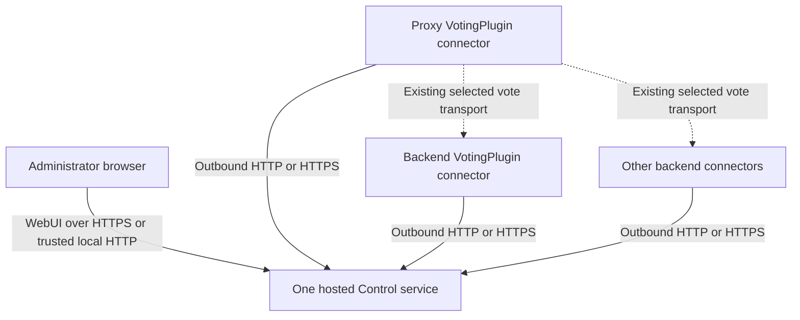

# VotingPlugin Control WebUI

> **Development-build feature:** Control integration is not available in the latest public VotingPlugin release, **7.1.1**. Unless a section requires a later development build, the management and inspection suite described here requires a development build containing merged commit [`034e39aa`](https://github.com/BenCodez/VotingPlugin/commit/034e39aae5890db249a51109fa0ee2d2561b7142) or later and [VotingPlugin-Control v1.0.2](https://github.com/BenCodez/VotingPlugin-Control/releases/tag/v1.0.2). Release users do not have the VotingPlugin connector or hosting settings yet. Details may change before a compatible VotingPlugin release.
{.is-warning}

VotingPlugin Control is an optional, local-first management application for a VotingPlugin network. Its WebUI can show enrolled proxies and backends, coordinate reviewed configuration changes, and request bounded read-only diagnostics from capable backend nodes.

Control does **not** receive votes or replace VotingPlugin's existing proxy communication method. Voting continues normally if Control is stopped, slow, unavailable, or disabled.

## Control v1.0.2 compatibility boundary

> **VotingPlugin 7.1.1 is not compatible with these workflows:** Control v1.0.2 includes the scope-first WebUI, network-aware visual General Settings, Vote Sites and Rewards editors, the Full YAML workbench, negotiated HTTP proxy-method switching, a private VotingPlugin artifact store, and VotingPlugin JAR staging. Existing named reward-file editing requires merged VotingPlugin commit [`4fd3b439`](https://github.com/BenCodez/VotingPlugin/commit/4fd3b4396c0c475f4adecfd6f1c70fa06d13c157) or later. Verified JAR staging requires merged commit [`e89e60bd`](https://github.com/BenCodez/VotingPlugin/commit/e89e60bd064f96c90499b6b5cabfe1ea2ae143e9) or later. HTTP and its negotiated `config.proxy-method.v2` workflow require merged development commit [`46088736`](https://github.com/BenCodez/VotingPlugin/commit/460887368d2a980b79bb8cebd518d5a5bd3f5913) or later. These changes are merged into development but have not shipped in a public VotingPlugin release. Installing Control v1.0.2 alone does not add them to release VotingPlugin nodes; wait for a compatible public VotingPlugin release.
{.is-warning}

Control v1.0.2 includes these bounded workflows without changing Control's role in vote processing:

- Home supports one-backend, persistent multi-backend, and separate Global Settings workspaces. Selecting or navigating a workspace never applies configuration.
- General Settings reads every selected capable backend plus the managed proxies that report those backends. It keeps per-node values visible and previews only explicit allow-listed edits against each target's retained `Config.yml` or `bungeeconfig.yml` source. Vote Sites and Rewards remain backend workspace editors.
- Existing inline Vote Site rewards support a bounded simple editor. Existing named `Rewards/<name>.yml` files are available only when a node advertises `config.reward-files.v1`; they can be opened in the source-preserving Full YAML workbench but cannot be created, deleted, or used to browse arbitrary files.
- HTTP method selection uses negotiated `config.proxy-method.v2`; older nodes remain connected but are excluded from HTTP previews and applies.
- An administrator can upload a VotingPlugin JAR from an eligible client or select the latest successful build from Control's fixed bencodez.com Jenkins source. Control verifies either artifact into its private, content-addressed store and can stage it only on selected nodes advertising `plugin.deploy.v1`. Install the first deployment-capable VotingPlugin build manually on each node; a node without the deployment endpoint cannot use Control to bootstrap that endpoint.
- Windows proxy nodes do not advertise deployment because the running proxy JAR cannot be replaced safely there. Update those proxy nodes manually.
- Staging verifies the artifact identity and SHA-256, reports per-node results, and ends at `RESTART_REQUIRED`. Control does not reload or restart a Minecraft process automatically.
- A retry creates a new operation for currently eligible failed targets; it does not replay successful targets implicitly.
- The Full YAML workbench identifies the source node, file, and retained revision; shows synchronized line numbers, document size, cursor position, and confirmed or unsaved state; and provides bounded in-document search. These browser-side aids do not parse, normalize, save, or bypass the connector's redaction and preview validation.
- The full YAML editor and guided configuration workflows now say that nothing has been saved after a successful preview, focus **Approve and apply** when it is available, and treat Ctrl/Command+S in the full YAML editor as preview-only. Proxy-method switching uses its separate preview and browser-confirmation flow.

Continue using manual VotingPlugin updates and manual HTTP configuration unless every selected node runs a compatible development build and advertises the required capability. For production networks, wait for a compatible public VotingPlugin release.

## Architecture


```mermaid
flowchart TB
    A[Administrator browser] -->|WebUI over HTTPS or trusted local HTTP| C[One hosted Control service]
    P[Proxy VotingPlugin connector] -->|Outbound HTTP or HTTPS| C
    B1[Backend VotingPlugin connector] -->|Outbound HTTP or HTTPS| C
    B2[Other backend connectors] -->|Outbound HTTP or HTTPS| C
    P -.->|Existing selected vote transport| B1
    P -.->|Existing selected vote transport| B2
```

Run one Control service for the network. It can be supervised by either one BungeeCord/Velocity proxy or one Bukkit/Paper backend. Every participating proxy or backend initiates its own outbound connection to Control; enabling Control does not open an inbound listener inside a Minecraft process.

Hosting and enrollment are separate:

- `Control.Hosted.Enabled` supervises the separate Control child JVM.
- Proxy `Control.Enabled` enrolls that proxy.
- Backend `Control.Backend.Enabled` enrolls that backend for configuration and inspection features.

## Before you start

1. Back up the VotingPlugin configuration on every participating node.
2. Install the same compatible VotingPlugin development build on the proxy and backends you will manage.
3. Decide which **one** proxy or backend will host Control.
4. Decide how every enrolled node will reach that listener.
5. Use loopback or a trusted private network for HTTP. Use HTTPS or a private authenticated tunnel across an untrusted network.
6. Give every proxy and backend a unique, stable node identity.

Control authentication does not encrypt traffic. Never expose a plaintext Control listener directly to the public internet.

## Host Control on a proxy

This is the simplest layout when all backends can reach the proxy's private address. In the hosting proxy's `bungeeconfig.yml`:

```yaml
Control:
  Enabled: true
  Endpoint: 'http://127.0.0.1:8080'
  NodeId: ''
  CredentialFile: 'control/control-credential.txt'
  HeartbeatSeconds: 30
  ConnectTimeoutMillis: 3000
  RequestTimeoutMillis: 5000
  Hosted:
    Enabled: true
    AutoDownload: true
    AutoUpdate: true
    DownloadUrl: ''
    Sha256: ''
    JarFile: 'control/votingplugin-control.jar'
    DataDirectory: 'control/data'
    Host: '127.0.0.1'
    Port: 8080
    StartupTimeoutSeconds: 30
    DownloadTimeoutSeconds: 60
```

A blank proxy `NodeId` reuses `ProxyServerName`. Every simultaneously connected proxy must still resolve to a different stable ID.

`Host: '127.0.0.1'` makes the WebUI reachable only from the proxy host. Keep this default when using an SSH tunnel or local reverse proxy. Bind to a private interface only when remote backends or administrators must reach Control directly.

## Host Control on a backend

In the hosting backend's `Config.yml`:

```yaml
Control:
  Hosted:
    Enabled: true
    AutoDownload: true
    AutoUpdate: true
    DownloadUrl: ''
    Sha256: ''
    JarFile: 'control/votingplugin-control.jar'
    DataDirectory: 'control/data'
    Host: '127.0.0.1'
    Port: 8080
    StartupTimeoutSeconds: 30
    DownloadTimeoutSeconds: 60
  Backend:
    Enabled: true
    NodeId: ''
    Endpoint: 'http://127.0.0.1:8080'
    CredentialFile: 'control/control-credential.txt'
    HeartbeatSeconds: 30
    ConnectTimeoutMillis: 3000
    RequestTimeoutMillis: 10000
```

A blank backend `NodeId` reuses `BungeeSettings.Server`. The value must be unique and stable.

Only one server should set `Control.Hosted.Enabled: true`. Other nodes should enable only their connector and point `Endpoint` to the selected host.

## Download and update behavior

With a blank `DownloadUrl` and `Sha256`, the hosted manager selects the latest stable `BenCodez/VotingPlugin-Control` GitHub release, verifies the immutable release and exact asset name, then checks the JAR against GitHub's published SHA-256 digest before activation. `AutoUpdate: true` checks for a newer stable release every six hours.

The hosted application runs as a separate child JVM using the host's Java runtime. A candidate is staged and verified before the healthy version is stopped. VotingPlugin retains the previous verified JAR for rollback and quarantines a failed digest until a newer release is available.

To pin an exact build, configure both an immutable versioned `DownloadUrl` and its exact `Sha256`. For an offline installation, place the JAR at `JarFile`, set its exact `Sha256`, and disable both automatic download and update.

## First WebUI login

On the first successful start, Control writes a one-time setup code inside the configured data directory:

```text
control/data/web-setup-code.txt
```

1. Open the Control WebUI.
2. Read the setup code through the server's file manager or local filesystem.
3. Enter it in the browser and choose the administrator password.
4. Store the password in a password manager.

The setup code is consumed immediately. Changing the WebUI password invalidates existing browser sessions.

## Enroll proxies and backends

Each node receives a separate credential bound to its stable node ID. A credential for one node cannot authenticate as another node. Browser sessions and API automation credentials are also separate from node credentials.

### Proxy-hosted automatic enrollment

When the proxy hosts Control and enrolls itself through the same local listener, VotingPlugin can generate the proxy credential and install only its SHA-256 verifier into Control automatically.

> **Development builds only:** Cross-transport backend enrollment requires merged VotingPlugin commit [`0b90ca3e`](https://github.com/BenCodez/VotingPlugin/commit/0b90ca3e9b5bc133927d40fc5c0b63d68f061329) or later. VotingPlugin 7.1.1 does not include automatic Control enrollment.
{.is-warning}

Automatic backend enrollment can use the selected `BungeeMethod`: `PLUGINMESSAGING`, `HTTP`, `REDIS`, `MQTT`, `SOCKETS`, or `MYSQL`. Each backend uses:

```yaml
Control:
  Backend:
    Enabled: true
    NodeId: ''
    Endpoint: 'http://proxy-private-address:8080'
    CredentialFile: 'control/control-credential.txt'
    HeartbeatSeconds: 30
    ConnectTimeoutMillis: 3000
    RequestTimeoutMillis: 10000
```

The backend keeps the raw credential locally and sends only its verifier through the proxy. The proxy installs that verifier into its hosted Control only after proving that the configured route reaches that Control instance. Enrollment retries do not replace an existing nonblank credential.

Automatic enrollment requires a stable node identity matching `BungeeSettings.Server`. Plugin Messaging and HTTP bind the backend identity through their transport paths. Redis, MQTT, sockets, and MySQL additionally require the same private `secretkey.key` on the proxy and backend so enrollment messages can be authenticated.

For automatic backend enrollment, `Endpoint` must address the hosted listener directly as `http://<non-loopback-host>:<Control.Hosted.Port>/`. It cannot use HTTPS, a loopback address such as `localhost` or `127.0.0.1`, a reverse-proxy path, a query, or a fragment. When `Control.Hosted.Host` is a specific interface instead of a wildcard, the endpoint host must match that configured value exactly. The endpoint must also be reachable **from the backend**.

Use manual enrollment in the WebUI or owner tooling for an external Control installation, a custom node ID, an existing credential, an HTTPS or reverse-proxy endpoint, or another topology that cannot use the direct hosted-listener address.

Do not copy one credential file between servers. Keep every credential file inside its node's VotingPlugin data directory and exclude it from public backups, screenshots, and support bundles.

## Use the workspace

The WebUI is capability-driven. Select a node and check its accepted capabilities instead of assuming support from a version string.

Start on **Overview** after selecting a server or network context in the header. The dashboard combines bounded health cards, Attention Required items, topology, logged-service activity, and recent operations. A missing, malformed, or failed sub-inspection is shown as incomplete health data rather than a healthy result. Quick actions open the existing capability-gated setup, configuration, diagnostics, and inspection workflows; they do not apply fixes automatically.

### Scope-first workspaces

Home lets an administrator choose one Bukkit backend, multiple Bukkit backends, or the separate Global Settings scope. Proxy nodes remain visible but are not Bukkit configuration targets. Opening one server's overview does not replace a multi-server workspace, and Global Settings does not mean every server. The current scope and selected IDs are kept only for the authenticated browser tab; preview tokens, configuration documents, and secrets are not stored there.

General Settings, Vote Sites, and Rewards are workspace-aware editors. Each eligible backend is read separately, and the UI distinguishes same, mixed, missing, unsupported, and failed values. Editing a supported subset requires explicit acknowledgement. Each changed target receives its own revision-bound preview and one-time approval; there is no network-wide transaction. A partial apply stays visible per target, and successful targets are read again before their displayed state is treated as confirmed.

Legacy guided presets, the reward builder, and Full YAML remain single-source tools. Inspecting a backend outside the selected workspace does not authorize editing it, and navigating between pages never stages a write.

### Visual General Settings

The curated editor exposes bounded boolean, enum, and string controls from backend `Config.yml` and proxy `bungeeconfig.yml`: debug level, online mode, automatic Vote Site creation, fake-vote counting, unjoined-player handling, the main vote GUI command, default permissions, command aliases, case-insensitive YAML lookup, Bedrock prefix, per-site cooldown events, update checking, and closing inventories on vote. A reporting proxy is included with its selected backends so network-wide values remain visible per node. Missing, unsupported, or incorrectly typed values are not synthesized from defaults. Settings marked as startup-only still require the indicated backend or proxy restart after the reviewed write.

### Visual Vote Sites

The Vote Sites editor manages the main `VoteSites.yml` only. For an exact site key it can edit `Enabled`, `Name`, `ServiceSite`, `VoteURL`, `VoteDelay`, `Priority`, `Hidden`, `DisplayItem.Material`, and `DisplayItem.Amount`, or explicitly add or remove a site. It preserves unrelated properties and inline rewards. A site key—not its display name or service matcher—is its identity. Split VoteSites files are not part of this visual editor.

### Visual Rewards

The Rewards workspace inventories inline and advanced reward scopes without flattening unsupported structures. Its bounded simple editor can create or remove an inline Vote Site reward, edit ordered commands, `Messages.Player`, `Messages.Broadcast`, scalar `Money` or `Chance`, and existing item `Material` or `Amount` leaves when their source shape is safe. Advanced structures such as `AdvancedPriority`, `Choices`, nested rewards, conditions, ranges, and unrecognized keys remain read-only in the visual view. For scopes in the managed `Config.yml`, `VoteSites.yml`, or `SpecialRewards.yml` files, use Full YAML when editing is required.

Nodes advertising `config.reward-files.v1` can also inventory and edit the root of existing, directly contained named `Rewards/<name>.yml` files. Control v1.0.2 can open those discovered files in the same source-preserving, redacted Full YAML workbench used for other managed files. The feature does not create or delete named files, resolve references, or provide general filesystem access. Older connectors continue to support the other editors but show named reward files as unsupported.

| Area | What it is for | Important boundary |
| --- | --- | --- |
| Overview | Bounded health cards, Attention Required, topology, logged-service activity, and recent operations | Read-only aggregation; incomplete checks cannot produce a fully healthy result |
| Setup | Guided network, vote-site, logging, reward, and common-setting workflows | A setup still requires preview and approval; loading a profile never applies it |
| Configuration | Read and edit allow-listed VotingPlugin YAML files | Secrets are masked; every write uses the safe change workflow |
| Network Doctor | Connector, configuration, Votifier, vote-site, reward, storage, logging, and topology checks | Read-only reported state, not a synthetic vote |
| Activity | Current and recovered configuration operations, phases, reloads, rollbacks, and safe retries | A recovered operation is history and is not resumed after Control restarts |
| Snapshots | Durable redacted copies of completed configuration reads | Not a full server backup and cannot recover an old secret |
| Configuration drift | Compare exact redacted revisions across capable nodes | Read-only; compare before choosing a source of truth |
| Votes & Data | Exact-player, vote-site health, VoteLog, resolution, simulation, and diagnostic views | Read-only, bounded, and available only from capable backend nodes |

### Managed configuration files

Capable backend nodes can expose these user-facing files:

- `Config.yml`
- `VoteSites.yml`
- validated split files under `VoteSites/`
- `SpecialRewards.yml`
- `GUI.yml`
- `Shop.yml`
- `BungeeSettings.yml`

Existing named `Rewards/<name>.yml` files use the separate optional `config.reward-files.v1` capability. They are discovered through the Rewards inventory and can then be opened in Full YAML for one explicitly selected capable backend; they are not added to an arbitrary file browser.

A capable proxy node can expose its single `bungeeconfig.yml` file when it advertises `config.proxy-files.v1`. This does not enable arbitrary proxy file browsing. Saving this file reports that a proxy restart is required; it does not claim a full proxy hot reload.

Reads mask password, secret, token, API-key, authorization, and webhook-secret paths. Leaving `__VOTINGPLUGIN_CONTROL_REDACTED__` unchanged preserves the node's current local value. A replacement secret can be submitted through an authenticated preview, but Control does not return or audit it.

### Guided setup

The current setup workflows cover:

- standalone or proxy-connected backend basics;
- adding or updating a vote site;
- automatic vote-site creation;
- common operational settings;
- VoteLogging state, retention, and main-connection selection;
- Vote Party basics; explicitly changing the enabled state requires `config.quick-setup.v2`, while older v1 connectors are not sent that extension;
- simple and structured rewards;
- reward simulation before saving;
- command suggestions for detected Essentials/EssentialsX, CMI, and LuckPerms installations.

Browser-local setup profiles store non-secret form values only. They do not contain credentials or raw YAML and never apply automatically. Load live values before changing an existing configuration.

### VoteSites synchronization

VoteSites synchronization copies site definitions from one selected source backend to selected capable targets. It intentionally preserves each target's local secrets and reward subtrees. Review the preview on every target before approval.

Use synchronization for common site metadata, not as a backup or reward-deployment shortcut. Configure rewards through their dedicated workflow or the normal managed-file preview.

### Communication tests and proxy-method switching

Transport tests request a bounded check through a node's existing VotingPlugin communication path. They diagnose current configured connectivity; they do not send a public vote or replace a real end-to-end vote test.

Coordinated proxy-method switching validates capabilities and current topology, previews the proposed changes, and applies only after approval. All participating nodes must support the selected method and its required configuration. Take external backups before a network-wide transport migration.

Control v1.0.2 retains `MYSQL`, `PLUGINMESSAGING`, `REDIS`, `MQTT`, and `SOCKETS` through `config.proxy-method.v1` and includes negotiated `config.proxy-method.v2` for HTTP. HTTP is not a v1 option. Nodes that do not advertise the exact v2 capability are excluded from HTTP previews and applies; VotingPlugin 7.1.1 does not advertise it.

### VotingPlugin update staging

Control v1.0.2 provides a **Plugin update** workspace. It can accept one bounded local VotingPlugin JAR or download the latest successful development build from a fixed bencodez.com Jenkins job; administrators cannot supply an arbitrary remote URL. Control verifies the embedded plugin identity, computes the SHA-256, stores the artifact by that digest, and shows which connected nodes currently advertise `plugin.deploy.v1` before an operation is created. Direct plain-HTTP uploads require the actual client socket to be loopback, link-local, private IPv4, or IPv6 ULA. Uploads through a reverse proxy require HTTPS, secure cookies, and an explicitly trusted proxy that overwrites `X-Forwarded-Proto`.

VotingPlugin 7.1.1 does not advertise `plugin.deploy.v1`. Manually install a development build containing merged commit `e89e60bd` or later once on every intended node. Endpoint eligibility is enforced by the installed connector build: use HTTPS unless that build explicitly documents and enables another supported local/private policy, and follow its initialization diagnostic when the capability is withheld. Windows proxy nodes remain ineligible and must be updated manually. After eligible nodes reconnect, Control can stage later VotingPlugin JARs.

Each selected node downloads the exact verified artifact through a session- and attempt-bound lease, stages it for the next process start, and reports either `RESTART_REQUIRED` or a bounded failure. Bukkit backends preserve the filename of the currently installed VotingPlugin JAR when placing the update in the server update folder. Control never hot reloads VotingPlugin, restarts a server, or turns a failed target into an automatic retry. Review the per-node result, then restart successful targets through the normal server-management process.

The store is private and bounded to 32 artifacts and 512 MiB. Retained deployment history protects referenced artifacts from eviction. Treat uploaded JARs and the Control data directory as trusted administrative material and include them in the host's access-control and backup policy.

## Safe change workflow

Every configuration write uses the same sequence:

1. **Read** the current redacted configuration and revision.
2. **Preview** the exact proposed change independently on every selected target.
   At this point nothing has been saved. Ctrl/Command+S in the full YAML editor also performs this preview step only.
3. Review all target changes and failures.
4. Confirm the one-time approval generated for that successful preview.
5. **Apply** using the exact revisions from preview.
6. Inspect each node's save, reload, and rollback result.

If another process changes a target after preview, apply fails as stale instead of overwriting the newer content. A node stages and atomically replaces the managed YAML, keeps `.control-backup`, reloads VotingPlugin, and restores the backup if reload fails.

An approval belongs to one exact preview and is consumed once. Editing the proposal or changing the target selection requires a new preview.

## Snapshots and restore

A Control snapshot stores the complete **redacted** document returned by a successful read. It does not contain the node's old credentials and is not a copy of the plugin directory, database, or other server files.

Restoring a snapshot loads one stored document as a new proposal. Preview it against the target's current revision, review the diff, and approve it through the normal workflow. Unchanged redaction markers resolve to each target's current local secrets.

Protect the entire Control data directory and its backups with owner-only filesystem permissions or equivalent access controls.

## Votes & Data

The read-only inspection lane can provide:

- network and backend overview;
- configured vote-site health and persisted unconfigured-service observations;
- exact player lookup by name or UUID;
- VoteLog summary, bounded logged-event search, and correlation-ID timeline;
- a side-effect-free service-site resolution test;
- reward proposal validation and simulation;
- redacted diagnostics used by Network Doctor.

These views do not allow SQL, arbitrary player enumeration, raw configuration or logs, command execution, reward execution, or writes.

VoteLog views contain retained **logged events**, not a complete packet or command trace. A correlation timeline does not prove that every transport hop or reward command was recorded.

> Changing `VoteLogging.Enabled` writes and reloads `Config.yml`, but the runtime VoteLog manager is created or closed only during plugin startup. Restart VotingPlugin after changing this setting. A newly enabled node can report enabled but unavailable until restart.
{.is-warning}

## Security checklist

- Host one Control service for the network.
- Bind to loopback when using a local reverse proxy or tunnel.
- Use HTTPS or a private authenticated tunnel outside a trusted private network.
- Keep the WebUI password, API credential, setup code, and node credential files private.
- Use one credential per stable node ID; revoke or rotate a credential when a server is retired or compromised.
- Restrict access to the Control data directory, snapshots, audit data, and hosted JAR files.
- Review every target diff before approval.
- Keep external backups of VotingPlugin configuration and databases.
- Treat downloaded diagnostics as sensitive operational data even though known secrets are redacted.

## Troubleshooting

| Symptom | Check |
| --- | --- |
| WebUI does not start | Check the hosted status/log, Java runtime, bind address/port, filesystem access, artifact digest, and startup timeout. |
| Backend cannot enroll | Confirm the endpoint is reachable from that backend, its `BungeeSettings.Server` is unique, and the supported enrollment path is available. Do not use remote `localhost`. |
| Node is visible but configuration is unavailable | Check that it is a Bukkit backend and that `config.files.v1` was accepted for its current session. |
| A preview cannot be approved | All selected targets must finish successfully. Correct the failure and create a new preview. |
| Apply reports a stale revision | Another process changed the configuration after preview. Read again and prepare a new preview. |
| Control restarted during an operation | Treat recovered activity as history. Start a fresh read or preview; Control does not replay ambiguous writes. |
| VoteLog says enabled but unavailable | Restart VotingPlugin after enabling VoteLogging, then check database connectivity and table readability. |
| Network Doctor is healthy but votes still fail | Run a real Votifier vote through the complete public listener and delivery path. Network Doctor is not a synthetic vote test. |
| The hosted update rolled back | Inspect the hosted log and retained failed candidate. Do not bypass digest or health verification. |
| No connected node is eligible for a VotingPlugin deployment | VotingPlugin 7.1.1 lacks `plugin.deploy.v1`. Manually install a development build containing merged commit `e89e60bd` or later once, then reconnect the node. Use HTTPS unless that connector build explicitly documents and enables another supported local/private policy, and check its initialization diagnostic for the exact reason staging was withheld. Windows proxy nodes are intentionally ineligible and require manual updates. |
| A VotingPlugin deployment says `RESTART_REQUIRED` | The JAR was staged successfully but is not active yet. Restart that node through the normal server-management process. |

## Disable Control

Disable each connector and the single hosted manager, then restart the affected proxy or backend:

```yaml
Control:
  Hosted:
    Enabled: false
  Backend:
    Enabled: false
```

On a proxy, set `Control.Enabled: false` as well. Disabling or removing Control does not change VotingPlugin's existing vote transport, storage, or reward processing.

## Related pages

- [Proxy Setups](/VotingPlugin/Proxy-Setups)
- [Dedicated Voting Proxy](/VotingPlugin/Dedicated-Voting-Proxy)
- [Vote sites](/VotingPlugin/Service-sites)
- [Rewards](/VotingPlugin/Rewards)
- [VoteLogging](/VotingPlugin/VoteLogging)
- [Commands and Permissions](/VotingPlugin/Commands-&-Permissions)
- [Web Support](/VotingPlugin/Web-Support)

## Source references

- [VotingPlugin Control connector implementation notes](https://github.com/BenCodez/VotingPlugin/blob/master/docs/control-connector.md)
- [VotingPlugin Control management reference](https://github.com/BenCodez/VotingPlugin-Control/blob/main/docs/control-management.md)
- [VotingPlugin Control v1.0.2](https://github.com/BenCodez/VotingPlugin-Control/releases/tag/v1.0.2)
- [Automatic settings and HTTP v2 merge (Control PR #13)](https://github.com/BenCodez/VotingPlugin-Control/pull/13)
- [Verified VotingPlugin artifact-store merge (Control PR #14)](https://github.com/BenCodez/VotingPlugin-Control/pull/14)
- [VotingPlugin staging merge (Control PR #15)](https://github.com/BenCodez/VotingPlugin-Control/pull/15)
- [Explicit preview-to-apply workflow (Control PR #16)](https://github.com/BenCodez/VotingPlugin-Control/pull/16)
- [Verified staging bootstrap guidance (Control PR #17)](https://github.com/BenCodez/VotingPlugin-Control/pull/17)
- [Scope-first Control WebUI v1 (Control PR #18)](https://github.com/BenCodez/VotingPlugin-Control/pull/18)
- [Full YAML workbench (Control PR #20)](https://github.com/BenCodez/VotingPlugin-Control/pull/20)
- [Proxy and named reward Full YAML targets (Control PR #23)](https://github.com/BenCodez/VotingPlugin-Control/pull/23)
- [Verified Jenkins artifact source (Control PR #24)](https://github.com/BenCodez/VotingPlugin-Control/pull/24)
- [Network-aware General Settings (Control PR #25)](https://github.com/BenCodez/VotingPlugin-Control/pull/25)
- [Named reward-file connector capability (VotingPlugin PR #1612)](https://github.com/BenCodez/VotingPlugin/pull/1612)
- [VotingPlugin deployment capability (VotingPlugin PR #1609)](https://github.com/BenCodez/VotingPlugin/pull/1609)
- [VotingPlugin HTTP and deployment capabilities (PR #1594)](https://github.com/BenCodez/VotingPlugin/pull/1594)
- [VotingPlugin proxy configuration management merge (PR #1596)](https://github.com/BenCodez/VotingPlugin/pull/1596)
- [Development backend `Config.yml`](https://github.com/BenCodez/VotingPlugin/blob/master/VotingPlugin/src/main/resources/Config.yml)
- [Development proxy `bungeeconfig.yml`](https://github.com/BenCodez/VotingPlugin/blob/master/VotingPlugin/src/main/resources/bungeeconfig.yml)
