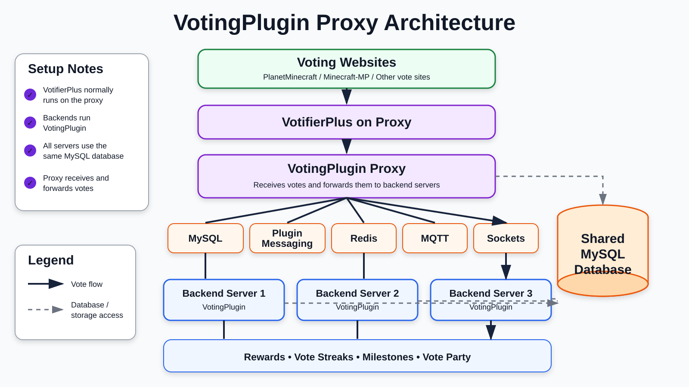
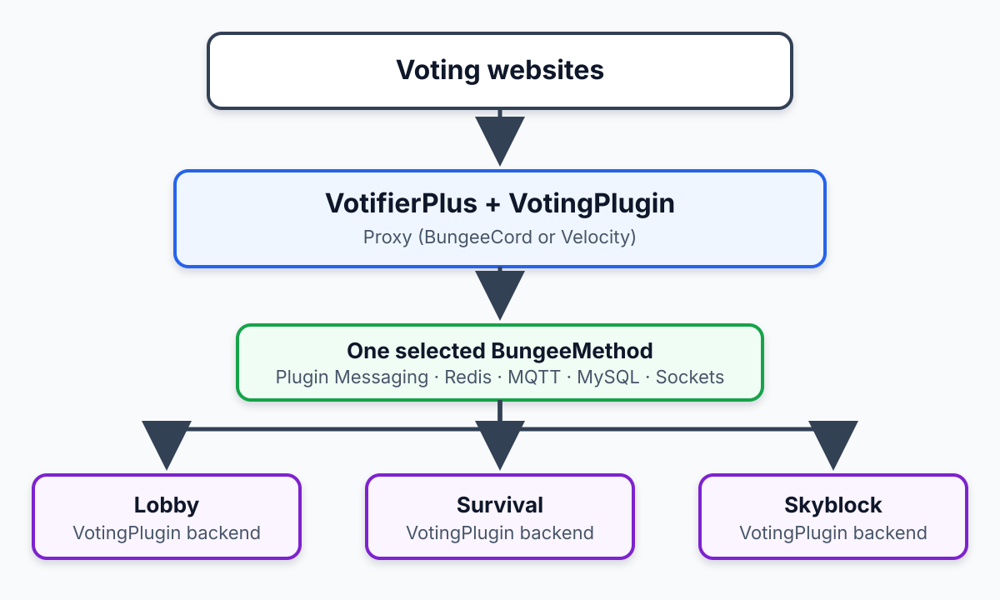

> ⚙️ **Running on Velocity**
>
> Velocity requires the JDBC driver selected by `DbType`. Install the [MySQLDriver build](https://bencodez.com/job/MySQLDriver/) when the platform does not already provide the required driver.
{.is-info}

> 💾 **Database Requirement**
>
> All VotingPlugin proxy methods require a shared SQL database, with the proxy and every participating backend using compatible connection and table settings.
>
> With the released default `BungeeManageTotals: true`, the **proxy** manages user vote totals and points. If it is false, each backend adds its own totals; the 7.1.1 default configuration describes that layout as unsupported.
>
> Backend servers process rewards, milestones, streaks, and other gameplay behavior according to their own settings.
{.is-info}

> 📨 **Votifier Configuration**
>
> In the standard layout, **VotifierPlus/NuVotifier** runs on the proxy and VotingPlugin handles forwarding to backends. Custom Votifier routing can differ, but each vote must enter VotingPlugin only once to avoid duplicate processing.
{.is-info}

---

# Proxy Methods

VotingPlugin supports multiple communication methods between your **proxy (BungeeCord/Velocity)** and backend servers. Select one `BungeeMethod` and configure it consistently on the proxy and participating backends.

| Method | Description |
|--------|-------------|
| [PLUGINMESSAGING](Proxy-method-PLUGINMESSAGING) | Uses the proxy plugin-message channel; this is the 7.1.1 release default. |
| [REDIS](proxy-method-REDIS) | Uses a private Redis service for cross-server messages. |
| [MQTT](proxy-method-MQTT) | Uses an MQTT broker for cross-server messages. |
| [SOCKETS](proxy-method-SOCKETS) | Uses direct TCP socket connections and requires explicit peer addresses, secrets, and firewall rules. |
| [MYSQL](proxy-method-MYSQL) | Uses the shared database as the communication path; the 7.1.1 defaults do not recommend this method. |

---

## How It Works

> This diagram shows the typical single-proxy network layout. Multi-proxy setups and custom Votifier routing may use a different topology. The supported communication methods converge through one selected/configured path to the backend servers.
{.is-info}

When a player votes:

1. The **proxy** receives the vote from **VotifierPlus/NuVotifier**.
2. VotingPlugin validates and records the vote; it updates totals when `BungeeManageTotals: true`.
3. The proxy forwards or caches the vote using the configured `BungeeMethod`.
4. The selected backend server or servers process rewards and gameplay behavior according to `SendVotesToAllServers`, `ProcessRewards`, server restrictions, and reward settings.

> With `BungeeManageTotals: true`, the proxy is the central controller for vote tracking and forwarding. Backend servers focus on reward delivery and gameplay logic.

---

## Abilities

VotingPlugin’s proxy integration provides network-wide support for:

- 🌍 **Global or per-server rewards**
- 🎉 **Proxy-wide or individual server vote parties**
- ⏰ **Global time synchronization** (via the experimental `GlobalData` setting)
- 🧱 **Server blocklist/allowlist controls**
- 🔁 **Multi-proxy synchronization**
- 📊 **Centralized vote totals and logging when `BungeeManageTotals: true`**
- ⚙️ **Local reward and streak logic on backend servers**

---

## Dedicated Voting Proxy

> **Development builds only:** A dedicated voting proxy is not available in VotingPlugin 7.1.1. Development builds containing merged PRs [#1550](https://github.com/BenCodez/VotingPlugin/pull/1550) and [#1551](https://github.com/BenCodez/VotingPlugin/pull/1551) can run VotingPlugin on one central proxy while separate regional proxies carry players.
>
> See [Dedicated Voting Proxy](Dedicated-Voting-Proxy) for the architecture, prerequisites, routing behavior, configuration, security model, migration, and validation steps.
{.is-warning}

---

## Multi-Proxy Support

For networks with multiple proxies, `MultiProxyMethod` supports **SOCKETS** or **REDIS** synchronization between proxies. This is separate from the backend `BungeeMethod` selected for communication between a proxy and its backend servers.

> ⚠️ **Note:** The 7.1.1 bundled configuration labels multi-proxy support as work in progress. Test vote delivery and duplicate prevention before using it in production.
>
> See [Multi-Proxy Setup](Multi-Proxy-Setup).
{.is-warning}

---

## More Technical Details (Summary)

The proxy receives and manages votes from Votifier before forwarding them to backend servers.

### Proxy Responsibilities
- 📨 **Receives votes** from VotifierPlus/NuVotifier in the standard layout.
- 🕓 **Handles time-change conditions** when `GlobalData` is enabled.
- 🧩 **Resolves UUIDs** and supports configured Bedrock prefixes.
- 💾 **Manages totals** when `BungeeManageTotals: true`.
- 🎉 **Updates vote-party progress** and routes configured vote broadcasts.
- 🔁 **Forwards or caches votes** depending on player presence and configuration.
- 🌐 **Supports multi-proxy synchronization** when explicitly enabled and configured.

### Backend Responsibilities
- Executes rewards, milestones, and streak processing when enabled.
- Handles in-game logic and GUI-related features.
- Adds its own totals only when `BungeeManageTotals: false`.

---

### Common Config Keys
| Key | File/location | Description |
|-----|---------------|-------------|
| `BungeeManageTotals` | Proxy `bungeeconfig.yml` | Enables proxy-managed totals; true is the supported 7.1.1 default. |
| `SendVotesToAllServers` | Proxy `bungeeconfig.yml` | Sends votes to all eligible backends or only the player’s selected/current server. |
| `AllowUnJoined` | Proxy `bungeeconfig.yml` | When false, the proxy validates that the player has joined before accepting the vote. Capitalization is significant. |
| `AllowUnjoined` | Backend `Config.yml` | When true, a backend accepts forwarded votes without repeating the proxy’s joined-player check. |
| `WaitForUserOnline` | Proxy `bungeeconfig.yml` | Queues votes until the player logs in. |
| `ProcessRewards` | Backend `Config.yml` | Controls whether that backend processes rewards for forwarded votes. |
| `GlobalData` | Proxy `bungeeconfig.yml` and backend `BungeeSettings.yml` | Enables experimental global time/reset coordination; align it on all participating instances. |
| `MultiProxySupport` | Proxy `bungeeconfig.yml` | Enables synchronization between multiple proxies. |
| `PrimaryServer` | Proxy `bungeeconfig.yml` | Marks the primary proxy for supported multi-proxy responsibilities. |

---

## Simple flow reference

This compact version preserves the older proxy-flow overview. The detailed architecture near the top of this page is the authoritative reference for communication methods and shared storage.

---

*For the release implementation, see [`VotingPluginProxy.java` at tag 7.1.1](https://github.com/BenCodez/VotingPlugin/blob/7.1.1/VotingPlugin/src/main/java/com/bencodez/votingplugin/proxy/VotingPluginProxy.java).*
