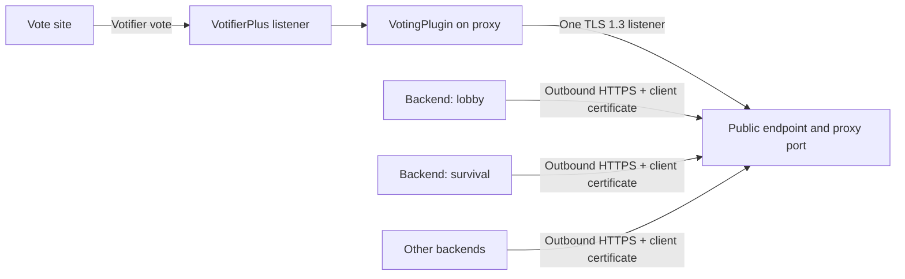

# HTTP Proxy Transport

> **Development-build feature:** `BungeeMethod: HTTP` is not available in the latest public VotingPlugin release, **7.1.1**. [VotingPlugin PR #1594](https://github.com/BenCodez/VotingPlugin/pull/1594) is merged into development at commit [`46088736`](https://github.com/BenCodez/VotingPlugin/commit/460887368d2a980b79bb8cebd518d5a5bd3f5913), but it has not shipped in a public release. Release users do not have the `HTTP` method, its configuration keys, or its proxy commands. Use a build containing `46088736` or later only for development testing; production networks should wait for a compatible public VotingPlugin release.
{.is-warning}

The HTTP proxy method gives every backend an **outbound**, encrypted connection to one HTTPS listener on the BungeeCord or Velocity proxy. Only the proxy listener port needs to be reachable. Backend servers do not expose an HTTP transport port.

HTTP transports VotingPlugin's normal proxy messages. It does not receive public Votifier votes, replace VotifierPlus, change player UUID handling, or change reward and offline-vote rules. Configure the public vote listener and VotingPlugin vote sites normally.

## Architecture



The proxy generates a private certificate authority, proxy identity, and short-lived enrollment codes. Each backend enrolls once and receives a client identity bound to its configured `Server` name.

## Before you start

- Install the same compatible VotingPlugin build on the proxy and every backend.
- Give every backend a unique, stable `Server` value in `BungeeSettings.yml`.
- Choose one hostname that resolves to the proxy from every backend.
- Allow one TCP port to the proxy listener. Do not open an HTTP transport port on a backend.
- Ensure the listener can terminate TLS itself. A reverse proxy or CDN must not terminate this connection because mutual TLS is part of the protocol.
- Back up the proxy and backend VotingPlugin data folders before changing methods.

Use a TCP/L4 proxy only when it passes the TLS connection through unchanged. For an Internet-facing listener, also use host or provider firewall controls; the application cannot absorb a volumetric link or TCP flood.

## Configure the proxy

In the proxy's `bungeeconfig.yml`, select HTTP and configure its listener:

```yaml
BungeeMethod: HTTP

HTTP:
  Host: '0.0.0.0'
  Port: 1297
  PublicEndpoint: 'https://proxy.example.com:1297/'
```

- `Host` is the local interface on which VotingPlugin listens. Use a narrower address when the network design permits it.
- `Port` defaults to `1297` in the development configuration.
- `PublicEndpoint` has no usable default. Set the HTTPS origin that every backend can reach directly.

`PublicEndpoint` must point to this VotingPlugin listener. Do not use an HTTP URL, a path below the origin, embedded credentials, a fragment, or a TLS-terminating CDN/reverse proxy.

Restart the proxy after selecting the method or changing listener settings.

## Enroll each backend

On the running proxy, create a separate code for the exact backend name:

```text
/votingpluginproxy httpcode lobby-1
```

Connection codes expire after 15 minutes, work once, and are bound to one backend name. Treat a fresh code like a temporary password: send it privately and do not place it in public logs, tickets, screenshots, or chat rooms.

The proxy command requires `votingpluginproxy.admin`. Velocity also registers the short `/vpp` alias; use `/votingpluginproxy` in portable instructions for both proxy platforms.

On that backend, set the same method and paste its code into `BungeeSettings.yml`:

```yaml
UseBungeecord: true
Server: lobby-1
BungeeMethod: HTTP

HTTP:
  ConnectionCode: 'paste-code-here'
```

Restart the backend. After enrollment succeeds, remove `ConnectionCode` from the configuration and restart normally. The generated client identity remains in the backend's VotingPlugin data folder and is reused automatically.

Repeat the process with a new code for every backend. Never reuse one backend's code, data folder, or client identity on another server.

## Verify the setup

1. Confirm the proxy reports the HTTP method without listener or endpoint errors.
2. Confirm each backend enrolls under its exact configured `Server` name.
3. Remove the temporary connection code after successful enrollment.
4. Put at least one player online on each backend, then run the proxy status command and confirm every expected backend responds. The status command skips empty backends.
5. Send a real test vote through the public Votifier listener.
6. Test an online player and an offline player, then verify the normal cache and reward behavior on the intended backend servers.
7. Restart the proxy and one backend to verify that enrolled identities and pending deliveries recover.

A successful HTTP connection test does not prove that a vote site, Votifier token, vote-site mapping, database, reward, or player-name policy is correct. Always finish with a real end-to-end vote.

## Delivery and offline behavior

- Proxy-to-backend messages remain in a bounded, owner-only durable proxy queue until the backend acknowledgement is durably applied.
- The backend journals callback states so a completed callback can be acknowledged after restart without automatically running it twice.
- A callback interrupted at an ambiguous point is quarantined for operator investigation instead of being automatically replayed or silently acknowledged.
- An HTTP Vote Party threshold commit journals backend reward deliveries, the proxy broadcast, and ordered proxy commands together. Pending proxy effects resume after restart, but those local effects are at-least-once: a crash after execution and before progress is saved can repeat one. A Velocity command that does not complete within 60 seconds moves to `VoteParty.QuarantinedProxyEffects` for manual review instead of blocking later work.
- Backend-to-proxy delivery retains VotingPlugin's existing bounded in-process retry behavior; application vote caching remains responsible for vote durability in that direction.
- `SendVotesToAllServers`, `BlockedServers`, `WhiteListedServers`, `WaitForUserOnline`, dedicated-proxy presence, offline caching, UUID mode, and `BedrockPlayerPrefix` keep their existing meanings.

HTTP does not make duplicate backend names safe. Every backend must have a unique `Server` value, including Bedrock-enabled networks where name prefixes can otherwise create confusing identity collisions.

## Certificates and renewal

- Normal traffic requires TLS 1.3 and a backend client certificate bound to its canonical server identity.
- Enrollment pins the generated private authority and proxy identity while retaining hostname verification.
- Proxy and backend leaf certificates renew automatically during their pre-expiry window; routine renewal does not require a new connection code.
- Keys, pins, credentials, revocation data, queues, and delivery state are stored within VotingPlugin data folders using atomic, owner-only files where supported.

Keep the proxy's HTTP data directory private and backed up. It contains the transport authority and durable delivery state. Do not copy a backend credential directory between servers.

## Revoke or replace a backend

If a backend host or its private identity may be compromised, revoke it on the proxy before enrolling a replacement:

```text
/votingpluginproxy httprevoke lobby-1
```

Generate a new code, install it only on the intended replacement backend, and restart that backend. A genuinely new code requests re-enrollment even when old local credential files still exist.

## Migrate from another proxy method

1. Update the proxy and every backend to the same compatible build.
2. Record the current method and its settings so rollback is possible.
3. Configure and restart the proxy with `BungeeMethod: HTTP`.
4. Open only the selected proxy TCP port.
5. Enroll and restart each backend with its own code.
6. Test status, online votes, offline votes, restarts, and failure recovery.
7. Remove temporary connection codes after enrollment.

Only one `BungeeMethod` is active. Do not assume the previous Redis, MQTT, MySQL, sockets, or plugin-messaging transport remains a fallback.

To roll back, select the previous method on the proxy and every backend, restore its required settings, and restart all participating instances. Keep the HTTP authority data private even when the method is inactive, or retire it according to your backup and credential policy.

## Control WebUI compatibility

The current public Control release, **v1.0.0**, includes negotiated `config.proxy-method.v2` support for HTTP. The latest public VotingPlugin release, 7.1.1, does not advertise that capability and cannot use HTTP. Configure this development transport manually unless every selected node runs a development build containing merged commit `46088736` or later.

Control [PR #13](https://github.com/BenCodez/VotingPlugin-Control/pull/13) is included in v1.0.0, while the merged-but-unreleased VotingPlugin commit `46088736` provides the node-side `config.proxy-method.v2` workflow for HTTP. The proxy-method workflow previews the change and then asks for browser confirmation before applying it. Verify that the proxy and every selected backend advertise v2 before using the WebUI. For production networks, wait for a compatible public VotingPlugin release. Retain console access and external backups for rollback.

## Troubleshooting

| Symptom | Check |
| --- | --- |
| Proxy reports that HTTP is not running | Confirm `BungeeMethod`, `Host`, `Port`, and `PublicEndpoint`, then restart the proxy. |
| `httpcode` fails | Confirm the listener started and `PublicEndpoint` is a valid directly reachable HTTPS origin with a valid port. |
| Backend cannot enroll | Confirm the code is unexpired, unused, and bound to the backend's exact unique `Server` name. Generate a fresh code when uncertain. |
| Backend repeatedly presents an old identity | Revoke the old backend, generate a genuinely new code, and restart with that new code. |
| TLS or hostname verification fails | Confirm DNS, the exact public hostname, time synchronization, and that no TLS-terminating proxy or CDN is replacing the listener certificate. |
| Proxy reports incomplete or missing HTTP TLS identity files | Restore the complete proxy HTTP data directory from a trusted backup. Do not delete or regenerate only part of the identity once enrollment or durable outgoing state exists; the transport refuses to replace its authority silently. |
| Connection works but votes do not | Check VotifierPlus, vote-site service mapping, proxy routing, blocked/allowed servers, player identity rules, storage, and reward configuration. |
| Votes appear delayed | Check backend reachability and queue pressure. The connector uses bounded long polling and backpressure rather than unbounded queues. |
| Delivery remains quarantined after a crash | Investigate whether the reward callback may have run before deciding how to reconcile it. Do not blindly replay an ambiguous reward. |

## Related pages

- [Proxy Setups](/VotingPlugin/Proxy-Setups)
- [Dedicated Voting Proxy](/VotingPlugin/Dedicated-Voting-Proxy)
- [PLUGINMESSAGING](/VotingPlugin/Proxy-method-PLUGINMESSAGING)
- [Redis](/VotingPlugin/proxy-method-REDIS)
- [Votifier Troubleshooting](/VotingPlugin/Votifier-Troubleshooting)
- [Online and Offline Mode](/VotingPlugin/Online-Offline-Mode)

## Source references

- [VotingPlugin HTTP transport PR #1594](https://github.com/BenCodez/VotingPlugin/pull/1594)
- [Merged HTTP transport guide](https://github.com/BenCodez/VotingPlugin/blob/460887368d2a980b79bb8cebd518d5a5bd3f5913/docs/http-transport.md)
- [Merged proxy configuration](https://github.com/BenCodez/VotingPlugin/blob/460887368d2a980b79bb8cebd518d5a5bd3f5913/VotingPlugin/src/main/resources/bungeeconfig.yml)
- [Merged backend configuration](https://github.com/BenCodez/VotingPlugin/blob/460887368d2a980b79bb8cebd518d5a5bd3f5913/VotingPlugin/src/main/resources/BungeeSettings.yml)
